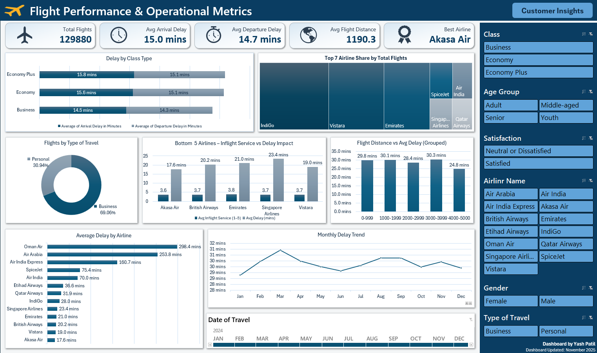

# ✈️ Airline Passenger Satisfaction Analysis

**Project Type:** Excel Dashboard & Data Analysis  
**Purpose:** Practice and improve Excel data analysis, visualization, and dashboard creation skills.  

## 📘 Project Overview

This project analyzes airline passenger satisfaction and flight operations using a dataset of **129,880 records** from multiple airlines.  
The goal is to identify key satisfaction drivers, study delay patterns, and compare airline performance.  

A two-page **interactive Excel dashboard** was built using **Pivot Tables, Charts, KPIs, and Slicers**, showcasing:
- **Page 1:** Passenger Satisfaction Insights Dashboard
- **Page 2:** Flight Performance & Operational Metrics Dashboard 

## 🧩 Dataset Details

**Dataset Name:** Airline_Passenger_Satisfaction_Raw_Dataset.xlsx  
**Sheet Name:** Satisfaction_Data  
**Total Records:** 129,880  
**Total Columns:** 27  

### 📄 Major Columns:

- Passenger ID  
- Satisfaction (Satisfied / Neutral or Dissatisfied)  
- Gender  
- Customer Type (Loyal / Disloyal)  
- Age  
- Type of Travel (Business / Personal)  
- Class (Economy / Eco Plus / Business)  
- Flight Distance  
- Service Ratings (Wi-Fi, Food, Cleanliness, etc.)  
- Departure & Arrival Delay (Minutes)  
- Airline Name  

## 🧠 Project Objectives

1. Identify the factors influencing airline passenger satisfaction.  
2. Compare performance across airlines, classes, and travel types.  
3. Analyze how service quality and delays affect satisfaction.  
4. Provide insights and recommendations for improving customer experience.  

## 📂 File Details

### 📊 Dashboard Files
- `dashboard/Airline_Passenger_Satisfaction_Analysis_Dashboard.xlsx` — Main Excel dashboard
- `dashboard/Dashboard_Page-1.png` — Screenshot of first dashboard page  
- `dashboard/Dashboard_Page-2.png` — Screenshot of second dashboard page  

### 📁 Data Files
- `data/Airline_Passenger_Satisfaction_Raw_Dataset.xlsx` — Original dataset used for cleaning and analysis  

### 📄 Report Files
- `report/Airline_Passenger_Satisfaction_Final_Report.docx` — Written analysis, insights, and recommendations  
- `report/Airline_Passenger_Satisfaction_Task_Brief.docx` — Original project task description  

## ⚙️ Tools Used

| Tool | Purpose |
|------|----------|
| **Microsoft Excel** | Data cleaning, analysis, and dashboard creation |
| **Pivot Tables & Charts** | Summarizing satisfaction data |
| **Slicers & Timelines** | Adding interactivity to dashboards |

## 🧾 Dashboard Preview

Below are screenshots of the final Excel dashboard pages 👇  

### 🖼 Page 1 — Passenger Satisfaction Insights Dashboard


### 🖼 Page 2 — Flight Performance & Operational Metrics Dashboard


## 🔍 Analysis Process

1. **Data Cleaning**
   - Removed duplicates and blanks.  
   - Formatted data types (text, numbers, dates).  
   - Standardized categorical values.

2. **Data Preparation**
   - Created helper columns for KPIs.  
   - Segmented passengers by Class, Age, and Type of Travel.

3. **Dashboard Design**
   - Used Pivot Tables to summarize metrics.  
   - Added Slicers for Gender, Class, and Customer Type.  
   - Designed two pages:
     - Page 1: *Overall Performance Overview*  
     - Page 2: *Detailed Service Ratings & Insights*

4. **Visualization**
   - Used bar charts, donut charts, and KPIs.  
   - Applied a professional color palette and clean layout.

## 🔎 Key Insights (from Dashboard & Report)

1. **Top Airlines:** IndiGo, Vistara, and Emirates show the highest satisfaction rates.  
2. **Class Impact:** Business Class passengers report the highest satisfaction; Economy is lowest.  
3. **Delay Trends:** Average flight delay is around 15 minutes; medium-distance flights face the most delays.  
4. **Service Quality:** Wi-Fi, food quality, and entertainment are the strongest drivers of satisfaction.  

## 💡 Recommendations

1. **Upgrade Economy Services:** Improve Wi-Fi, meals, and seating comfort.  
2. **Reduce Mid-Range Flight Delays:** Optimize scheduling for 1000–3000-mile routes.  
3. **Enhance Inflight Entertainment:** Provide diverse content for long flights.  
4. **Strengthen Loyalty Programs:** Reward frequent and business travellers.   

## 🚀 How to Use This Project

1. Download the file:  
   `dashboard/Airline_Passenger_Satisfaction_Analysis_Dashboard.xlsx`  
2. Open it in **Microsoft Excel (Desktop)** — not in browser view.  
3. Explore using **Slicers** (for gender, class, etc.) and **Timelines** (for travel period).  
4. Check the visual dashboards and pivot summaries.  
5. Read the `report/Airline_Passenger_Satisfaction_Final_Report.docx` for detailed insights.

## 🎯 Learning Outcomes

By completing this project, I practiced and improved:
- Data cleaning and formatting in Excel  
- Creating interactive dashboards with slicers  
- Using pivot tables for business analysis  
- Designing professional visual reports  
- Summarizing insights in simple, clear language  

This project was created **purely for learning and practice purposes** in Excel data analytics.

## 🏗 Project Structure
```
Airline_Passenger_Satisfaction_Analysis/
|
|-- dashboard/
|   |-- Airline_Passenger_Satisfaction_Analysis_Dashboard.xlsx
|   |-- Dashboard_Page-1.png
|   |-- Dashboard_Page-2.png
|
|-- data/
|   |-- Airline_Passenger_Satisfaction_Raw_Dataset.xlsx
|
|-- report/
|   |-- Airline_Passenger_Satisfaction_Final_Report.docx
|   |-- Airline_Passenger_Satisfaction_Task_Brief.docx
|
|-- README.md
```

## 🚀 How to Use This Project

1. Download the file  
   ➤ `dashboard/Airline_Passenger_Satisfaction_Analysis_Dashboard.xlsx`  
2. Open in **Microsoft Excel (desktop)** — slicers and timeline filters work only in desktop mode.  
3. Explore:
   - Page 1 → Passenger Satisfaction Insights Dashboard 
   - Page 2 → Flight Performance & Operational Metrics Dashboard
4. Read `report/Airline_Passenger_Satisfaction_Final_Report.docx` for full insights.  


**Yash Patil**  
